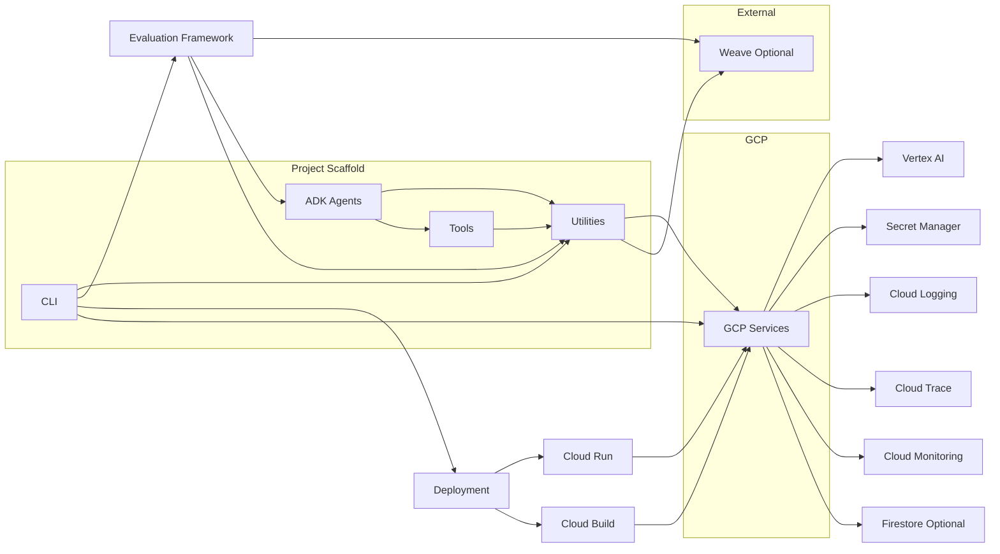

# Component Diagram

This diagram illustrates the main software components of the GCP Generative AI ADK Scaffold and their relationships.

**Explanation:**

*   **CLI:** The command-line interface, used by developers to interact with the scaffold and manage the project lifecycle. It interacts with Utilities, Deployment processes, and the Evaluation Framework.
*   **ADK Agents:** The core of the application, containing the agent logic. Agents use Utilities for common tasks and interact with Tools.
*   **Utilities:** A collection of shared modules providing common functionalities like interacting with GCP Services (Vertex AI, Secret Manager, Logging, Trace, Monitoring, Firestore), handling tokens, retries, etc. Both CLI, ADK Agents, and Tools depend on Utilities.
*   **Tools:** Implementations of external tools that ADK Agents can call. Tools may use Utilities (e.g., for secret retrieval).
*   **GCP Services:** Represents the various Google Cloud services the application integrates with.
*   **Deployment:** Represents the process of building and deploying the application, primarily to Cloud Run, orchestrated by the CLI and leveraging Cloud Build.
*   **Evaluation Framework:** (Gamma Phase) Used for evaluating agent performance, interacting with ADK Agents and Utilities, and optionally logging to Weave.
*   **Weave:** (Optional) An external tool for enhanced observability and experiment tracking, receiving data from Utilities and the Evaluation Framework.

This diagram provides a high-level view of the main software components and their dependencies.
