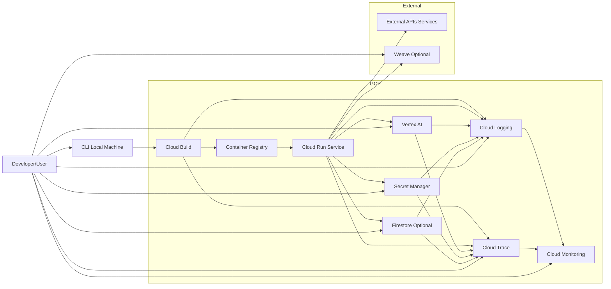

# Deployment Diagram

This diagram illustrates how the components of the GCP Generative AI ADK Scaffold are deployed onto Google Cloud Platform services.

**Explanation:**

*   **Developer/User:** Interacts with the CLI on their local machine.
*   **CLI (Local Machine):** Orchestrates the build and deployment process, primarily by interacting with Cloud Build. It also interacts with GCP services for provisioning (Gamma), prompt management, and secret management.
*   **Cloud Build:** Builds the Docker image from the source code and pushes it to Container Registry. Logs and traces from the build process go to Cloud Logging and Cloud Trace.
*   **Container Registry:** Stores the built Docker images.
*   **Cloud Run Service:** The serverless environment where the containerized ADK application runs. It receives requests and interacts with various GCP services (Vertex AI for models, Secret Manager for secrets, Firestore for state) and potentially external APIs. Logs and traces from the running service go to Cloud Logging and Cloud Trace.
*   **Vertex AI:** Provides access to generative models and managed Prompt Classes.
*   **Secret Manager:** Securely stores application secrets.
*   **Cloud Logging & Cloud Trace:** Collect logs and traces from Cloud Run, Cloud Build, and other GCP services for observability.
*   **Cloud Monitoring:** Visualizes metrics from Cloud Run and log-based metrics from Cloud Logging, and handles alerting. Users interact with Cloud Monitoring to view dashboards and alerts.
*   **Firestore:** (Optional) External storage for agent memory and state.
*   **External APIs/Services:** Any external services that the ADK agents interact with via tools.
*   **Weave:** (Optional) An external service for enhanced observability and experiment tracking, receiving data from the running application.

This diagram illustrates the physical deployment of the application components onto GCP infrastructure and their interactions.
