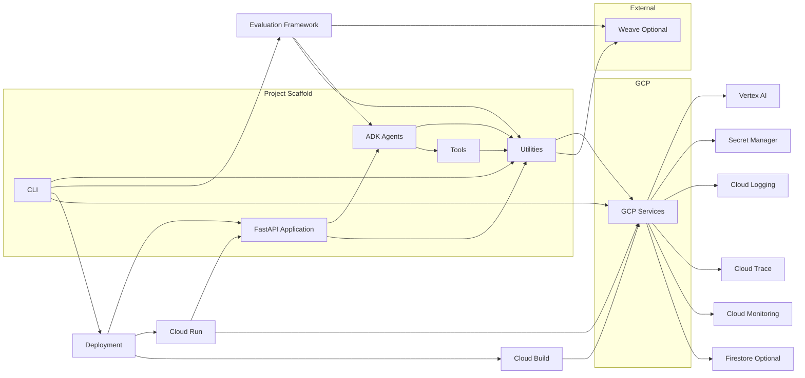

# System Patterns

This document describes the system architecture, key technical decisions, design patterns, component relationships, and critical implementation paths.

## System Architecture:
The system follows a component-based architecture with a central CLI for user interaction, ADK Agents for core AI logic, and a set of shared Utilities. Tools provide external capabilities to the agents. The application is designed for deployment on GCP, primarily Cloud Run, and integrates with various GCP services. A FastAPI application serves the ADK agent via HTTP, providing standard ADK endpoints and a custom health check.

### Command-Line Interface (CLI):
The CLI, implemented using Typer (`cli/main.py`), serves as the primary interface for developers to manage the project lifecycle. It is structured into main commands and subcommand groups for specific functionalities:
- **Main Commands:** `init`, `run`, `deploy`, `test`, `setup-gcp`.
- **Subcommand Groups:** `tools`, `prompts`, `secrets`, `monitoring`. These delegate specific tasks to dedicated modules (`cli/tools_cli.py`, `cli/prompts_cli.py`, `cli/secrets_cli.py`, `cli/monitoring_cli.py`).
The CLI orchestrates tasks by calling functions within the project's `utils/` modules and executing external commands (`gcloud`, `uvicorn`, `adk`, `pytest`) using Python's `subprocess` module. It loads configuration from the `.env` file via `dotenv`.

*Component Diagram illustrating the main software components and their relationships, including the FastAPI Application.*

## Key Technical Decisions:
- Use Poetry for package management (ADR 0001).
- Deploy on Cloud Run (ADR 0002).
- Use Vertex AI Prompt Classes (ADR 0003).
- Use Typer/Click for CLI (ADR 0004).
- Integrate Cloud Logging and Trace (ADR 0005).
- Use pytest for testing (ADR 0006).
- Integrate Google Secret Manager (ADR 0007).
- Use pre-commit hooks (ADR 0008).
- Use Firestore for state (Optional) (ADR 0009).
- Automate GCP provisioning with gcloud (ADR 0010).
- Use FastAPI/Uvicorn for backend (ADR 0011).
- Direct inference access to Gemini (ADR 0012).
- Handle token management with token count/trim (ADR 0013).
- Implement tool use with tools directory (ADR 0014).
- Use pytest-mock for testing (ADR 0015).
- Use Weave for optional observability (ADR 0016).
- Use Cloud Monitoring and Alerting (ADR 0017).
- Use Jupyter notebooks for experimentation (ADR 0018).
- Group features into phases (ADR 0019).
- Use evaluation framework (ADR 0020).
- Use Poetry for packaging (ADR 0021 - likely a duplicate or refinement of 0001).
- Use Cloud Build and Buildkit for container builds (ADR 0022).
- Use Gradio for test client (ADR 0023).
- Set CLI script alias to gen-bootstrap (ADR 0028 - supersedes 0024).
- Add python-a2a dependency (ADR 0025).
- Add fastmcp dependency and update Typer (ADR 0026).
- Use Buildpacks for deployment (ADR 0027).

## Design Patterns:
- Component-based architecture.
- Use of the Google ADK framework patterns for agent and tool development.
- CLI command pattern using Typer.
- Implementation of custom tools using `google.adk.tools.FunctionTool` by wrapping asynchronous Python functions.
- FastAPI application serving the ADK agent via a helper function (`get_fast_api_app`).
- Use of `subprocess` module within the CLI to execute external commands (`gcloud`, `uvicorn`, `adk`, `pytest`).

## Component Relationships:
- CLI interacts with Utilities (e.g., for configuration loading, potentially calling utility functions), Deployment processes (triggering builds and deployments), and Evaluation framework.
- ADK Agents use Utilities and Tools.
- Tools may use Utilities (e.g., for logging, potentially accessing secrets via Utilities).
- Utilities interact with GCP Services and optionally Weave.
- Deployment uses Cloud Build and targets Cloud Run, which interacts with GCP Services and the FastAPI Application.
- Evaluation interacts with ADK Agents, Utilities, and optionally Weave.
- The FastAPI Application serves the ADK Agent and uses Utilities (e.g., for logging, potentially configuration).

## Critical Implementation Paths:
- Defining and implementing ADK Agents and Tools.
- Integrating with necessary GCP services via Utilities.
- Implementing the CLI commands (`init`, `run`, `deploy`, `test`, `setup-gcp`, and subcommands) in `cli/main.py` and related modules, including their use of `subprocess` to orchestrate external tools.
- Setting up the FastAPI server to serve the ADK agent using `get_fast_api_app`.
- Configuring and executing the deployment process to Cloud Run, which runs the FastAPI application.
- Implementing custom tool logic within asynchronous functions wrapped by `FunctionTool`.
- Handling application startup and configuration within `main.py`.
